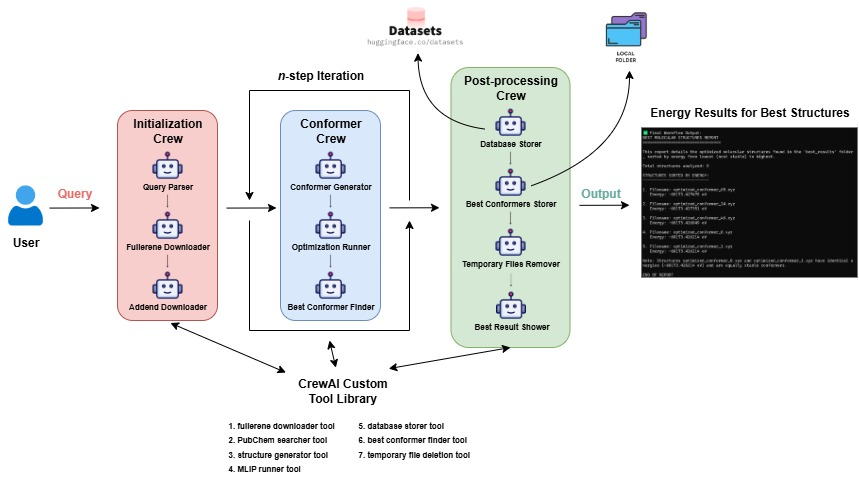

# The Fullerene Factory

**Repository of Team "The Fullerene Factory" for 2025 LLM Hackathon for Applications in Materials Science & Chemistry**

## Overview

The Fullerene Factory is an intelligent Python library that automates the generation and optimization of fullerene isomers with addends at various positions. Using advanced AI agents powered by CrewAI and state-of-the-art machine learning interatomic potentials (MLIPs), this tool streamlines the complex process of fullerene functionalization for materials science and chemistry applications.

## Overall Workflow

[](src/assets/fullerenefactory_workflow.jpg)

## Key Features

- **Natural Language Processing**: Parse complex chemistry queries using specialized AI agents
- **Automated Structure Generation**: Generate diverse 3D molecular conformers through controlled rotations
- **ML-Powered Optimization**: Optimize molecular geometries using FairChem's UMA model
- **Multi-Agent Workflow**: Coordinated AI agents handle different aspects of the pipeline
- **Database Integration**: Store and retrieve molecular structures from various sources
- **Energy Analysis**: Identify the most stable conformers based on calculated energies

## Architecture

The Fullerene Factory consists of three main crews of AI agents:

### 1. Initialization Crew

- **Query Parser**: Converts natural language into structured JSON parameters
- **Base Retriever**: Downloads fullerene structures from online databases
- **Addend Selector**: Intelligently selects or retrieves addend molecules from PubChem

### 2. Conformer Crew

- **Conformer Generator**: Creates diverse 3D molecular conformers through rotational sampling
- **Optimization Runner**: Performs geometry optimization using ML interatomic potentials
- **Best Conformer Finder**: Identifies the most stable structures based on energy

### 3. Post-Processing Crew

- **Database Storer**: Uploads results to Hugging Face datasets for persistence
- **Best Conformers Finder**: Analyzes and ranks optimized structures
- **Temporary Files Remover**: Cleans up intermediate files
- **Results Reporter**: Generates comprehensive energy reports

## Installation

### Prerequisites

- Python 3.13+
- CUDA-compatible GPU (recommended for optimization)
- Hugging Face account (for model access and data storage)
- DeepSeek API key (for AI agents)

### Setup

1. **Clone the repository:**

   ```bash
   git clone https://github.com/aritraroy24/the-fullerene-factory.git
   cd the-fullerene-factory
   ```

2. **Create and activate a virtual environment:**

   **Option A: Using uv (recommended):**

   ```bash
   # Install uv if you haven't already
   curl -LsSf https://astral.sh/uv/install.sh | sh

   # Create and activate virtual environment
   uv venv
   source .venv/bin/activate  # On Windows: .venv\Scripts\activate
   ```

   **Option B: Using standard Python venv:**

   ```bash
   python -m venv .venv
   source .venv/bin/activate  # On Windows: .venv\Scripts\activate
   ```

3. **Install dependencies:**

   **Option A: Using uv (recommended):**

   ```bash
   uv pip install -e .
   ```

   **Option B: Using standard pip:**

   ```bash
   pip install -e .
   ```

4. **Set up environment variables:**
   Create a `.env` file in the project root:

   ```env
   DEEPSEEK_API_KEY=your_deepseek_api_key_here
   HF_API_KEY=your_hugging_face_token_here
   ```

5. **Verify installation:**
   ```bash
   python -c "import fullerenefactory; print('Installation successful!')"
   ```

**Note:** Remember to activate your virtual environment (`source .venv/bin/activate` or `.venv\Scripts\activate` on Windows) whenever you work on the project.

## Quick Start

### Basic Usage

```python
from fullerenefactory import run_workflow

# Define your query
query = """Generate a C60 fullerene structure with an addend with SMILES 'CCO'.
Get single step addition products where the total number of angles to make conformers is 3.
Also, store all the optimized structures in the database and return the energy report as text data."""

# Run the workflow
result = run_workflow(query)
print(result)
```

### Command Line Usage

```bash
python run_workflow.py
```

## Supported Query Parameters

The system understands natural language queries and extracts the following parameters:

- **base_fullerene**: Target fullerene (e.g., "C60", "C70", "C84")
- **addends**: List of addend molecules (SMILES strings or common names)
- **num_steps**: Number of sequential reaction steps (default: 1)
- **num_angles**: Number of rotational angles for conformer generation (default: 5)
- **num_results**: Number of best structures to return (default: 3)
- **is_store_database**: Whether to store results in database (default: false)
- **is_delete_intermediate_files**: Whether to clean up temporary files (default: true)

## Example Queries

### Simple Functionalization

```
"Add methanol to C60"
```

### Complex Multi-Step Synthesis

```
"Generate C84 fullerene with phenyl addend. Perform 2-step addition with 4 conformer angles.
Store results in database and keep intermediate files."
```

### SMILES-Based Addends

```
"Functionalize C70 with addend SMILES 'COC1=CC2=C(C=C1)C=CC(=O)O2'.
Generate 5 best conformers."
```

## Output Structure

The workflow generates several types of outputs:

- **Temporary Files**: Intermediate conformers during generation (default: deleted after completion)
- **Best Results**: Top N optimized structures based on energy
- **Energy Reports**: Detailed analysis of conformer energies
- **Database Entries**: Stored structures for future reference (optional)

## Supported Fullerenes

The system includes a comprehensive database of fullerene structures:

- C20, C24, C26, C28, C30, C32, C34, C36, C38, C40
- C42, C44, C46, C48, C50, C60, C70, C72, C74, C76
- C80, C82, C84, C180, C240, C260, C320, C500, C540, C720

## Contributing

We welcome contributions! Please see our contribution guidelines and feel free to submit issues or pull requests.

## License

This project is licensed under the MIT License - see the [LICENSE](LICENSE) file for details.

## Citation

If you use The Fullerene Factory in your research, please cite:

```bibtex
@software{fullerene_factory_2025,
  title={The Fullerene Factory: AI-Powered Fullerene Functionalization},
  author={Team Fullerene Factory},
  year={2025},
  url={https://github.com/aritraroy24/the-fullerene-factory}
}
```

## Acknowledgments

- [FairChem](https://huggingface.co/fairchem) team for the UMA model
- [CrewAI](https://crewai.com) for the multi-agent framework
- [RDKit](https://www.rdkit.org) for molecular manipulation tools
- [PubChem](https://pubchem.ncbi.nlm.nih.gov) for chemical structure databases
- [Hugging Face](https://huggingface.co) for model hosting and datasets

## Support

For questions, issues, or feature requests:

- Open an issue on GitHub
- Contact the development team

## Team Members:

- Ilija Rašović (https://github.com/IlijaRasovic)
- Aritra Roy (https://github.com/aritraroy24)
- Piyush R. Maharana (https://github.com/catastropiyush)
- Yassir Ben Kacem (https://github.com/indra1080)
- Mourad El Haddaoui (https://github.com/indra1080)
- Nurlybek Temirbay (https://github.com/indra1080)

---

_Built with ❤️ for the materials science and chemistry community_
